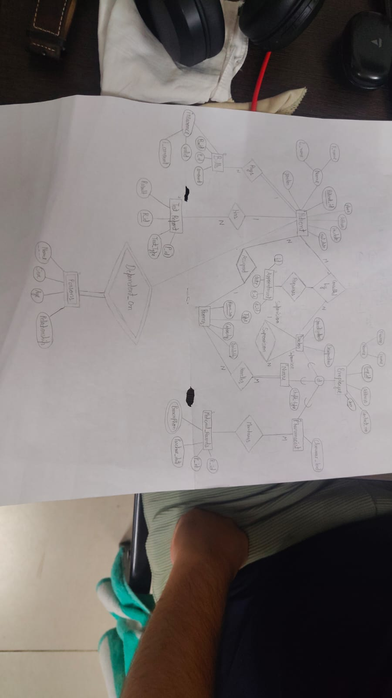
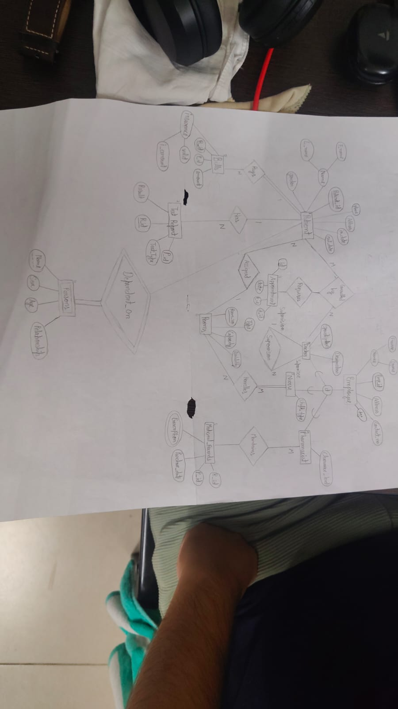

# DBMS-Project: Hospital Management System

A complete **Database Management System (DBMS)** project implementing the backend schema for a Hospital Management System, designed from a hand-drawn **Enhanced Entity-Relationship (EER) diagram**.

---

## 📐 EER Diagram

The hand-drawn EER diagram (2 pages):

| Page 1 | Page 2 |
| :---: | :---: |
|  |  |

---

## 🗂️ Project Structure

```
.
├── frontend/                          # React frontend application
│   ├── src/
│   │   ├── components/                # Reusable UI components (Layout, DataTable, etc.)
│   │   ├── data/                      # Mock data matching the SQL schema
│   │   ├── pages/                     # Page components (Dashboard, Patients, etc.)
│   │   ├── App.jsx                    # Root component with routing
│   │   ├── main.jsx                   # Entry point
│   │   └── index.css                  # Tailwind CSS styles
│   ├── index.html                     # HTML template
│   ├── vite.config.js                 # Vite configuration
│   └── package.json                   # Frontend dependencies
├── er_diagram_page1.jpg               # EER diagram (page 1)
├── er_diagram_page2.jpg               # EER diagram (page 2)
├── hospital management system code.txt # Full SQL script (DDL + seed data + 17 queries)
└── README.md                          # This file
```

---

## 🏥 EER Design Overview

### Strong Entities
| Entity | Attributes | Notes |
|---|---|---|
| **EMPLOYEE** | Emp_id (PK), F_name, L_name, Gender, Address, Contact_no, Age | Base entity of the specialization hierarchy |
| **PATIENT** | Patient_id (PK), F_name, L_name, Gender, Phone, In_date, Out_date | |
| **ROOMS** | Room_no (PK), Capacity, Type | Capacity → ROOMS_B |

### EER Specialization (is-a) — Disjoint, Total
`EMPLOYEE` is specialized into three subclasses, each sharing the primary key `Emp_id`:

- **DOCTOR** — Specialization, Designation, Supervisor_id
- **NURSE** — Shift_type
- **PHARMACIST** — Clearance_level

### Weak Entities (identifying relationship with PATIENT)
| Weak Entity | Partial Key | Identifying Relationship |
|---|---|---|
| **PERSONS** (dependents) | Name | Dependent_On |
| **TEST_REPORT** | R_id | Has |
| **BILLS** | B_id | Pays |

### Relationships
| Relationship | Entities | Cardinality | Implementation |
|---|---|---|---|
| **resides** | PATIENT – ROOMS | N:1 | `PATIENT_C.Room_no` FK chain |
| **Supervision** | DOCTOR – DOCTOR | Recursive | `DOCTOR.Supervisor_id` self-FK |
| **handles** | NURSE – ROOMS | M:N | `NURSE_HANDLES_ROOMS` |
| **Consulted_by** | PATIENT – DOCTOR | M:N | `Appointment_B` |
| **Maintains** | PHARMACIST – MEDICAL_RECORDS | 1:N | `RECORD_HANDLER` |
| **is_handled / Appointment** | PATIENT – APPOINTMENT | 1:N | `APPOINTMENT.P_id` FK |

### Normalization Chains
The design is normalized to **3NF** using transitive-attribute tables:

```
ROOMS_B (Capacity, Availability)  ←  ROOMS (Room_no, Capacity, Type)
PATIENT (Patient_id, ...) ← PATIENT_B (Phone, Address) ← PATIENT_C (Address, Room_no)
VALID (P_id, Valid) ← BILLS (B_id, P_id, Amount, I_amount)
```

---

## 🚀 Getting Started

### Prerequisites
- **Node.js** 18 or later (includes npm)
- Any standards-compliant RDBMS: **Oracle**, **MySQL**, **PostgreSQL**, or **SQLite 3.9+** (for the SQL script)

---

### Running the Frontend

1. Navigate into the frontend directory:
   ```bash
   cd frontend
   ```

2. Install dependencies:
   ```bash
   npm install
   ```

3. Start the development server:
   ```bash
   npm run dev
   ```

4. Open your browser and go to **http://localhost:5173**

That's it! The frontend uses mock data that mirrors the SQL schema, so you can explore all pages without setting up a database.

#### Frontend Commands

| Command | Description |
|---|---|
| `npm run dev` | Start development server with hot reload |
| `npm run build` | Build for production (output in `dist/`) |
| `npm run preview` | Preview the production build locally |

---

### Running the SQL Script (Backend)

1. Open your SQL client (SQL*Plus, MySQL Workbench, pgAdmin, DBeaver, etc.).
2. Open `hospital management system code.txt`, **select all → copy → paste into the SQL editor → execute**.
3. Every line in the file is valid SQL: all headings and explanations are SQL comments (`--`), so nothing throws a syntax error.
4. The script creates all 18 tables, inserts seed data, and runs all 17 sample queries in order.

> **MySQL users:** two dialect notes — queries 6, 9, 12, 14, 17 use `||` concatenation (MySQL needs `CONCAT(a, b)`), and query 16 uses `(Out_date - In_date)` (MySQL needs `DATEDIFF(Out_date, In_date)`). Query 15's integer division `I_amount/Amount` also differs on MySQL — wrap as `(I_amount * 100.0 / Amount)`. Everything else runs as-is.

### Re-runnability tip
If your RDBMS supports it, wrap the DDL with drop statements so the script can be replayed:

```sql
DROP TABLE NURSE_HANDLES_ROOMS, Appointment_B, RECORD_HANDLER, MEDICAL_RECORDS,
           APPOINTMENT, BILLS, VALID, TEST_REPORT, PERSONS,
           DOCTOR, NURSE, PHARMACIST,
           PATIENT, PATIENT_B, PATIENT_C,
           ROOMS, ROOMS_B, EMPLOYEE;
```

*(Drop children before parents so foreign-key constraints don't block the drops.)*

---

## 🔍 Sample Query Catalog

The script contains **17 worked-out queries**, each with an explanation:

| # | Concept | ER Feature Exercised |
|---|---|---|
| 1 | `WHERE` filtering | ROOMS entity |
| 2 | `IS NULL` | PATIENT admission status |
| 3 | `GROUP BY` aggregation | NURSE subclass |
| 4 | `ORDER BY` sorting | EMPLOYEE base entity |
| 5 | Simple 2-table join | Specialization (EMPLOYEE ⋈ PHARMACIST) |
| 6 | 4-table join | Consulted_by M:N relationship |
| 7 | `LEFT JOIN` | PATIENT left outer join BILLS |
| 8 | `HAVING` clause | BILLS aggregation |
| 9 | Recursive self-join | Supervision relationship |
| 10 | `IN` subquery | PERSONS weak entity |
| 11 | Aggregate subquery | BILLS vs. average |
| 12 | 5-table join | Nurse handles Rooms M:N |
| 13 | `EXISTS` correlated subquery | TEST_REPORT weak entity |
| 14 | Composite-key join | MEDICAL_RECORDS / RECORD_HANDLER |
| 15 | `CASE` expression | Derived column on BILLS |
| 16 | Date arithmetic | Length of hospital stay |
| 17 | `CREATE VIEW` | Reusable current-in-patient view |

---

## 🧱 Schema Map

```
                 ┌────────────┐  is-a (disjoint, total)   ┌──────────┐
                 │  EMPLOYEE  │◄─────────────────────────►│  DOCTOR  │──┐ Supervision (recursive)
                 └────────────┘                           └──────────┘◄─┘
                        ▲ is-a                        is-a ▲      ▲
                        │                                  │      │
                   ┌─────────┐   handles (M:N)   ┌────────┐ │      │
                   │  NURSE  │◄──────────────────►│ ROOMS  │ │ ┌────────────┐
                   └─────────┘                    └────────┘ │ │ PHARMACIST │
                                                             │ └────────────┘
        ┌─────────┐  resides (N:1)   ┌────────┐  Maintains │ 1:N  ┌─────────────────┐
        │ PATIENT │◄────────────────►│ ROOMS  │◄───────────┴──────┤ MEDICAL_RECORDS │
        └─────────┘                  └────────┘                   └─────────────────┘
             ▲ weak: PERSONS, TEST_REPORT, BILLS, APPOINTMENT (identifying rel.)
```

---

## 🛠️ Tech Stack

### Frontend
- **React 19** with Vite 8
- **Tailwind CSS 4** for styling
- **React Router 7** for client-side routing
- **Lucide React** for icons

### Backend (Database)
- **SQL** (ANSI-compatible, tested patterns for Oracle / MySQL / PostgreSQL)
- **EER modeling** with specialization/weak-entity mapping

## 📄 License
Educational project — free to use for coursework and learning.
